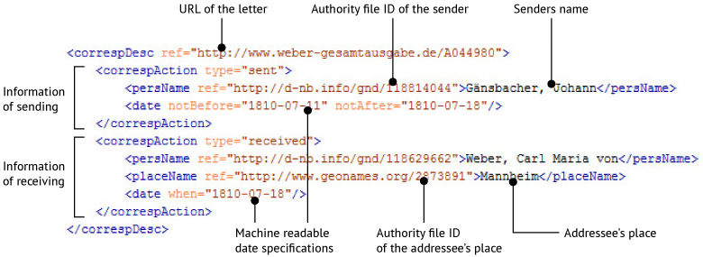

 
# Correspondence Metadata Interchange Format (CMIF) - Documentation

## Introduction

The "Correspondence Metadata Interchange Format" (CMIF) enables scholars to create digital indexes of letters from their scholarly editions and provide them online. The CMIF has been developed by the TEI Correspondence SIG and is a highly reduced and restricted subset of the TEI Guidelines which is based mainly on the TEI element `correspDesc`.

The Basis of a digital index of letters according to the CMI format is a TEI-XML file. You can download [templates with short descriptions here](https://github.com/TEI-Correspondence-SIG/CMIF/tree/main/examples).

## Overview

The TEI-XML file contains as many `correspDesc` elements as the provider have letters, postcards, etc. in his scholarly edition. A particular `correspDesc` element in CMI format is more restrictive and reduced with regard to its vocabulary than the TEI Guidelines generally allow. This enables interchange between the respective TEI documents.
    

*The image shows schematically the different parts of a `correspDesc` element in the CMI format. The addressee and sender are documented the same way. The example originates from this [example provided by the TEI Correspondence SIG](https://github.com/TEI-Correspondence-SIG/CMIF/blob/main/examples/example01_basic.xml).*    
  
For persons and places in the "correspondence description" (sender, addressee, senders place etc.) an ID from an authority file should be provided to identify these entities across projects and to use the correspondence metadata in network analysis or web services (e.g. [correspSearch](http://correspsearch.net)). Possible authority files for persons could be:

* [Virtual Authority File (VIAF)](http://viaf.org)
* [Gemeinsame Normdatei (GND)](http://www.dnb.de/gnd), Deutsche Nationalbibliothek
* [Autorités, Bibliothèque nationale de France](http://catalogue.bnf.fr/recherche-autorite.do) (BNF)
* [Library of Congress Authorities (LC)](http://authorities.loc.gov/)
* [Web NDL Authorities](http://id.ndl.go.jp/auth/ndla), National Diet Library (NDL), Japan

For places the TEI Correspondence SIG recommends to use the free licensed geographical database [GeoNames](http://www.geonames.org).

## Details

### Correspondence Metadata

The following table offers detailed information about the particular parts of a `correspDesc` element in the CMI format:

|XPath (relative to `correspDesc`)|Description|Value(s) and Notes|
| --- | --- | --- |
|/@key|Number or ID of the letter in the (printed or digital) scholarly edition. To note the number of the letter in @key is especially recommended for printed editions.|E.g. `"128"`|
|/@ref|URL of the letter, if available online. The URL should be an official and permanent link. If different versions of a letter are available, a canonical link should be used.|E.g. `"http://edition-humboldt.de/H0002656"`|
|/@source|Links with the help of an UUID (prefixed by "#") to the bibliographic information (i.e. where the correspondence metadata comes from). Form more information see `bibl/@xml:id` below.|E.g. `"#c3f497f0-488d-4233-9448-130ba8109bd8"`|
|/correspAction|Includes the data related to the sending/receiving process of a letter, postcard etc.|Only the following child elements (no text allowed): persName, orgName, placeName, date|
|/correspAction/@type|Type of the correspondence action|Allowed: `"sent", "received"`|
|/correspAction/persName|Personal name of sender or addressee|Mandatory; if the sender or addressee is unknown please indicate this by the string `"Unknown"`|
|/correspAction/persName/@ref|Authority controlled ID of sender or addressee|Strongly recommended, if available. Possible authority files: VIAF, GND, LC, BNF and NDL (see above) |
|/correspAction/orgName|Name of institution, company etc.|Optional, if `persName` is not applicable|
|/correspAction/placeName|Name of the place a letter was sent from or where it is being sent to|If available|
|/correspAction/placeName/@ref|Authority controlled ID of the place a letter was sent from or where it is being sent to|Strongly recommended, if available. Possible authority files: GeoNames (see above)|
|/correspAction/date|Machine-readable date of when the letter was sent or received|If available. The CMIF supports the attributes `@when, @from, @to, @notBefore` and `@notAfter`. To facilitate the interchange, the CMIF supports (unlike the TEI Guidelines) only the following date formats: YYYY-MM-DD, e.g. 1804-03-01; YYYY-MM, e.g. 1804-03; YYYY, e.g. 1808; |

The `correspDesc` elements are noted inside `TEI/teiHeader/profileDesc` - as described in the TEI Guidelines.

### Information about the digital index of letters

Besides the correspondence metadata, the provider have to include some information about the CMIF file and the digital index of letters itself in the `teiHeader/fileDesc` element. All elements there are mandatory if not stated otherwise.

|XPath|Description|Value(s) and Notes|
| --- | --- | --- |
|//titleStmt/title|Title of the digital index of letters|Free text field|
|//titleStmt/editor|Contact person concerning the digital index of letters|If available with an e-mail address in `editor/email`|
|//publicationStmt/publisher|Originator of the letter metadata as defined in the Creative Commons Licence CC-BY 4.0|Free text field|
|//publicationStmt/availability/licence|Licence statement|Mandatory: `"This file is licensed under the terms of the Creative Commons License CC-BY 4.0"`|
|//publicationStmt/availability/licence/@target|URL of the licence|Mandatory: `"https://creativecommons.org/licenses/by/4.0/"`|
|//publicationStmt/date/@when|Timestamp of the last update of this file|Format: xsd:dateTime|
|//publicationStmt/idno|URL of this digital index of letters|The URL serves as a unique identifier for the CMIF file and ensures that the file can always traced back to their origin|
|//publicationStmt/idno/@type|Type of the above mentioned identifier|Mandatory: `"URL"`|
|//sourceDesc/bibl|Bibliographic information about the scholarly edition from which the correspondence metadata is derived from.|No specifications.|
|//sourceDesc/bibl/@xml:id|Technical ID of the bibl element, i.e. the bibliographic information. An UUID has to be used. The correspDesc items have to be referenced by this UUID (see above @source).|E.g. `"c3f497f0-488d-4233-9448-130ba8109bd8"`. An UUID can easily be generated by [many online tools](https://www.google.de/search?q=uuid+generator). If the CMIF is created via a script (as common in digital scholarly editions), it is recommended to use a "static" UUID, i.e. which is not re-generated every time the CMIF data is updated.|
|//sourceDesc/bibl/@type|Type of scholarly edition|The following values are allowed: `"print", "online"`|
